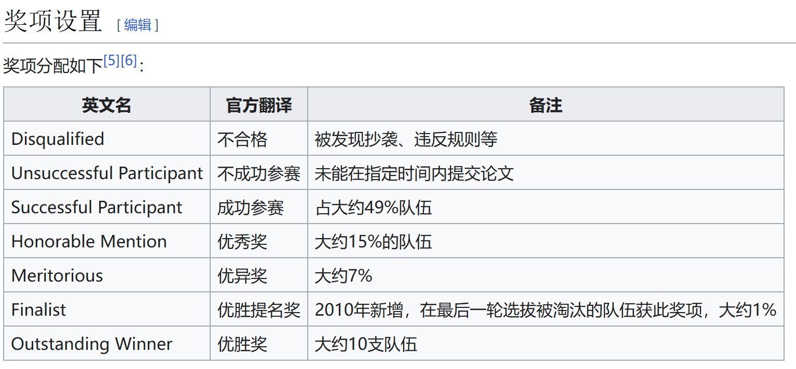
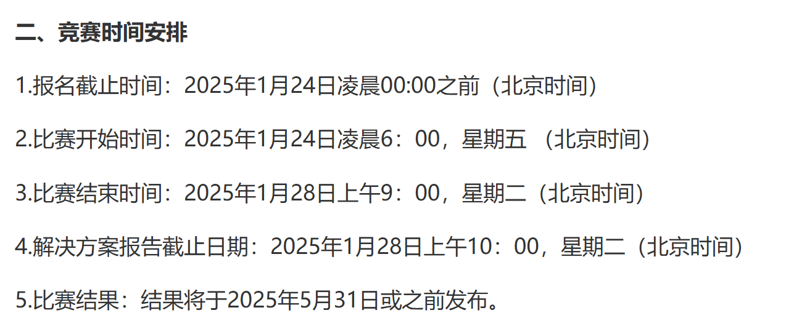
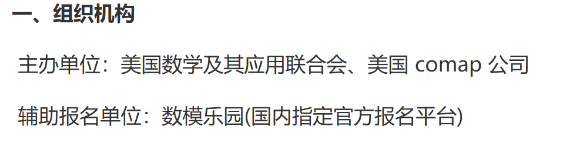
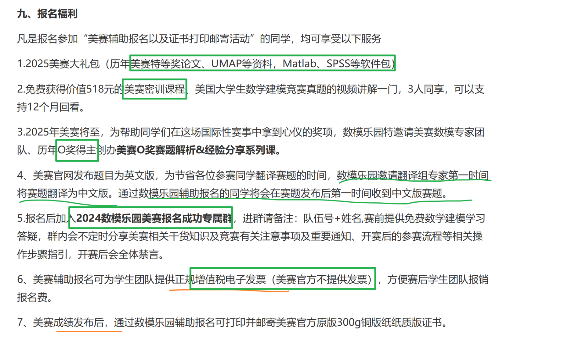

#  MCM 比赛简介

**Mathematical Contest In Modeling**

## **奖项设置：来自wikipidea （我们的目标是F - M)**

- 只要是S奖及以上以上，后面都会有三个证书给咱。证书上队员名字排名不分先后，各参赛队员具有同等的贡献率

## 比赛时间、报名时间、报名网站

### 竞赛时间线

四天 96h 

// 比赛结果时间有点儿晚啊。似乎在保研夏令营申请后（哭

[美赛报名入口 （里面还有关于比赛资料赠送、提交论文相关的信息，可以看看）](https://www.nmmcm.org.cn/match_detail/35)

# 选题

三道题选一题,比赛之前两个小时出题目

&nbsp;

# 碎知识：

TODO：加群（报名成功后会告诉你群账号），发票能否报账？

数学乐园：辅助报名的一个中国高校数学工作者协会（certificated）。

COMAP公司：The Consortium for Mathematics and Its Applications

&nbsp;

以后能用上的链接：

[数学建模比赛时间大全及报名费（知乎，之后还想比的话可以了解了解信息）](https://zhuanlan.zhihu.com/p/596147455)

&nbsp;